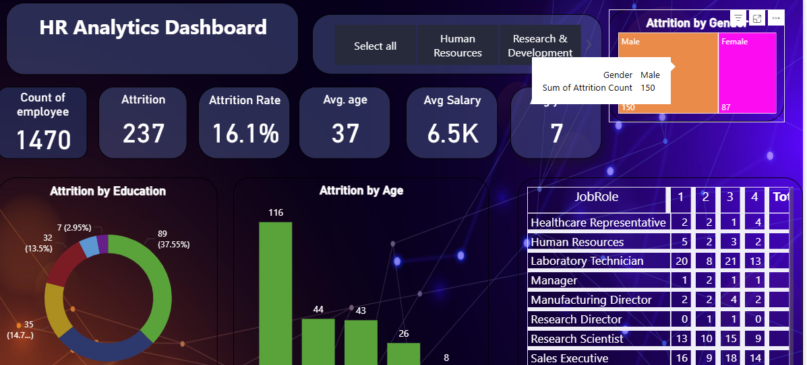
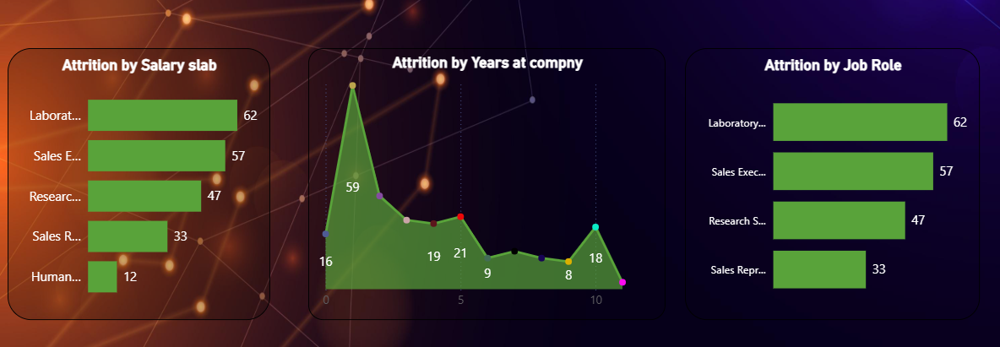

# HR-analytics-attrition-hiring-funnel-
HR Analytics Dashboard using Power BI for Employee Attrition Analysis
# 📊 HR Analytics Dashboard

## 📌 Project Overview
This project analyzes employee attrition data to identify key factors affecting employee turnover.

## 🛠 Tools Used
- Power BI
- Power Query
- DAX
- CSV Dataset

## 📂 Files Included
- HR_Analytics.csv (Dataset)
- HR analytics dashboard.pbix (Power BI Dashboard)

## 📊 Dashboard Preview

## 📈 Key Insights
- Attrition rate analysis
- Department-wise attrition
- Job role impact on attrition
- Age group and salary band analysis
- Overtime impact on employee turnover

## 🎯 Objective
To identify high-risk attrition segments and provide data-driven insights for HR decision-making.
